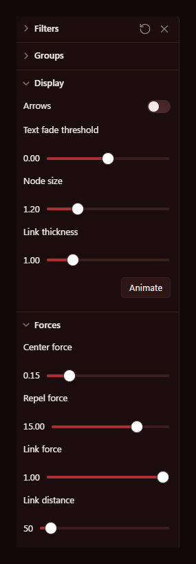
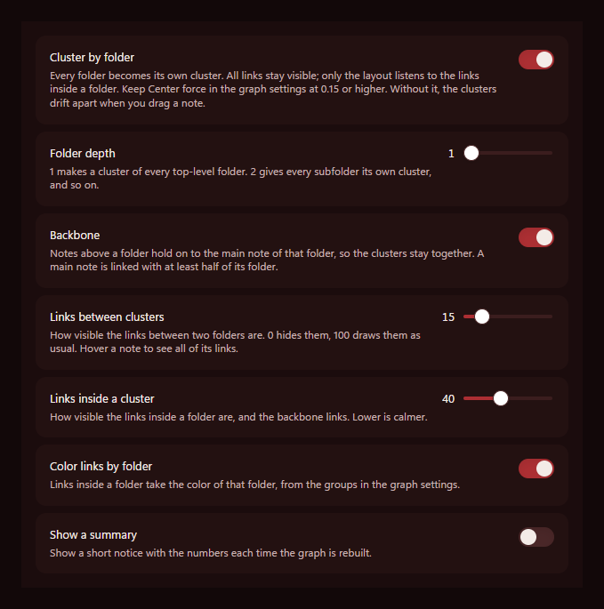

# Grape Clusters

## The Vineyard family

Vineyard is what I call the little Obsidian things I make and give away. So far that's this plugin and a theme, and they look best together.

| | 💎 Obsidian | 🐙 GitHub |
|---|---|---|
| 🍇 **Grape Clusters**, the plugin on this page | [Plugin page](https://community.obsidian.md/plugins/grape-clusters) | [Repository](https://github.com/creativemindrito/grape-clusters-obsidian) |
| 🍷 **Bordeaux**, the dark red theme in the screenshots | [Theme page](https://community.obsidian.md/themes/bordeaux) | [Repository](https://github.com/creativemindrito/bordeaux-theme-obsidian) |

My graph view never showed me much. I'd open it to see how my notes hang together and get one big grey knot in the middle of the screen. My notes link across folders all the time, a journal entry to a project and that project to a person, so Obsidian pulls everything into one pile.

I looked for a setting to group the graph by folder, and there isn't one. Some plugins come close, but they add extra dots for your folders or replace the graph with a view of their own. I wanted to keep Obsidian's own graph, with my links and my colors, and let every folder pull its notes together. I couldn't find one that works like that, so I made my own.

Grape Clusters keeps all your links on the screen. The ones between folders get lighter, so you can see the bunches. I first tried it on a vault with about 500 notes and 1,800 links, which is the screenshot above, and then kept going to 3,000.

## How it looks

I wanted to know if it holds up in a big vault, so I grew the same test vault in three steps. Every folder has its own color.

**500 notes in 9 folders**

**1,500 notes in 15 folders**

**3,000 notes: 2,700 in 21 folders and 300 loose ones**

I added the 300 loose notes on purpose, to see what happens to notes outside the clusters. Half of them are in a folder without a single link, and the other half sit outside every folder and link in. Grape Clusters doesn't pull them in, so they float around the edge.

At 3,000 notes the graph stutters a bit when you zoom all the way out. Zoomed in, it's smooth.

## How it works

Grape Clusters works with the links you already have. When two notes in the same folder link to each other, they pull together. A link between two different folders stays visible but lighter, and it doesn't pull. That way every folder gathers its own notes and the bunches have room between them.

## Make your first bunch

Here's how a bunch forms, with a `Recipes` folder as the example.

1. Put a few notes in a folder, for example `Recipes`.
2. Add one more note to that folder, say `Recipes index`, and link it to every recipe. This is the main note of the folder and it holds the bunch together. Grape Clusters finds it by itself as long as it's linked with at least half of the folder.
3. Open the graph view. The recipes pull together around `Recipes index`.
4. Link to `Recipes index` from a note in the root of your vault, like `Home`. Now the bunch stays near your other bunches instead of floating off on its own. The *Backbone* setting takes care of that.
5. Give the bunch a color. In the graph settings, open *Groups* and add `path:"Recipes/"` with a color you like.

Do the same for your other folders. A folder with one or two notes stays small, and that's fine.

## Settings

These are the settings I like best. Start from there and change whatever you like.

**My graph settings**

**Grape Clusters, the way it comes when you install it**

In Obsidian's settings, Grape Clusters has its own page at the bottom of the list on the left, under *Community plugins*.

| Setting | What it does | Default |
|---|---|---|
| Cluster by folder | Turns the whole thing on or off | On |
| Backbone | Keeps the clusters hooked to the notes above them, like the ones in your root folder | On |
| Folder depth | How deep a cluster forms: 1 is a top-level folder, 2 is every subfolder | 1 |
| Links between clusters | How visible the links between folders are | 15% |
| Links inside a cluster | How visible the links inside a folder are | 40% |
| Color links by folder | Lines inside a cluster get the color of that folder | On |
| Show a summary | Pops up a small notice with the numbers when the graph rebuilds | Off |

There's also a command called *Toggle folder clusters* if you want to flip back to the normal graph quickly.

## Install

The easiest way is inside Obsidian. Open *Settings → Community plugins*, click *Browse* and search for Grape Clusters, then click *Install* and *Enable*. If you've never used community plugins, Obsidian first asks you to turn them on.

You can also open the [Grape Clusters page](https://community.obsidian.md/plugins/grape-clusters) on the Obsidian website and click *Add to Obsidian*. Obsidian opens on the plugin, and you click *Install* and *Enable* there.

If you'd rather do it by hand, download `main.js` and `manifest.json` from the [latest release](https://github.com/creativemindrito/grape-clusters-obsidian/releases/latest). Put both in a folder called `grape-clusters` in `.obsidian/plugins/` inside your vault, and switch the plugin on under *Settings → Community plugins*.

After that, open the graph view.

## Privacy

Grape Clusters doesn't connect to the internet and never touches your notes. The only file it writes is its own settings file. The whole plugin is one file, `main.js`, without any dependencies, so you can read all of it.

GitHub builds every release itself from the tagged commit and adds an attestation, a signed record of where the files came from. To check a download, run `gh attestation verify main.js --owner creativemindrito`.

## Heads-up

Grape Clusters hooks into parts of the graph view that aren't an official Obsidian API. If an update changes those parts, it won't break your graph. It stops doing anything and tells you once, and turning it off always brings the normal graph back.

So far I've only tested it on Obsidian 1.13 on a computer. It changes the big graph view and leaves the local graph in the sidebar as it is.

## If something looks off

| What you see | What to do |
|---|---|
| Nothing changes at all | Check that you're in the big graph view and not the local graph. Still the same? Close the graph tab and open it again. |
| The clusters drift apart when you drag a note | Set *Center force* under *Forces* to 0.15 or higher. Grape Clusters takes away the pull between folders, so center force is what holds everything together. |
| A folder is a loose handful of dots | Its notes don't link to each other. Give the folder an index note that links to every note in it. |
| Your subfolders are one big bunch | Clusters form at the top-level folders. Set *Folder depth* to 2 and every subfolder gets its own. |
| Notes in the root of your vault float around the edge | Root notes don't get a cluster of their own. Link one to the main note of a folder and it hangs on to that folder. |
| A tag or attachment floats on its own | It's used in more than one folder, so it stays loose on purpose. Otherwise one `#todo` could pull all those folders into a knot. |

## Uninstall

Switch it off under *Settings → Community plugins* and the normal graph is back right away. Hit *Uninstall* there if you want it gone for good.

## Made by

[creativemindrito](https://github.com/creativemindrito). Free to use under the [MIT license](LICENSE). Found a bug or have an idea? Open an issue and tell me about it.
