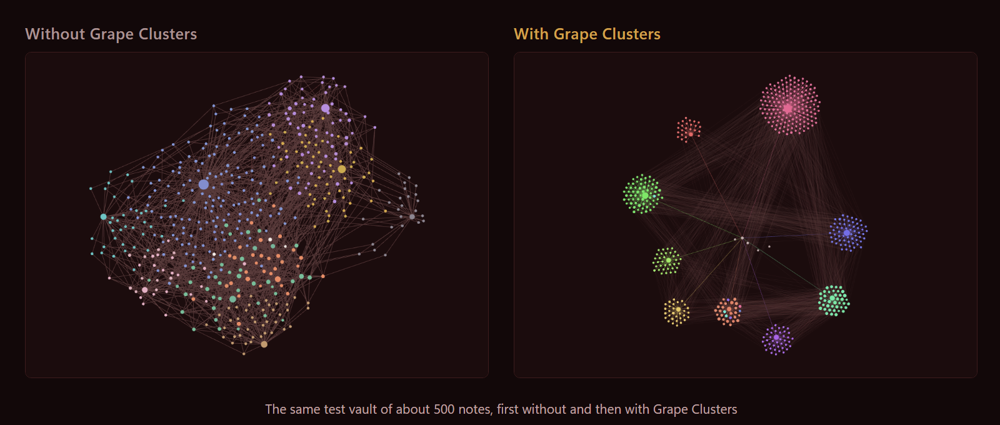
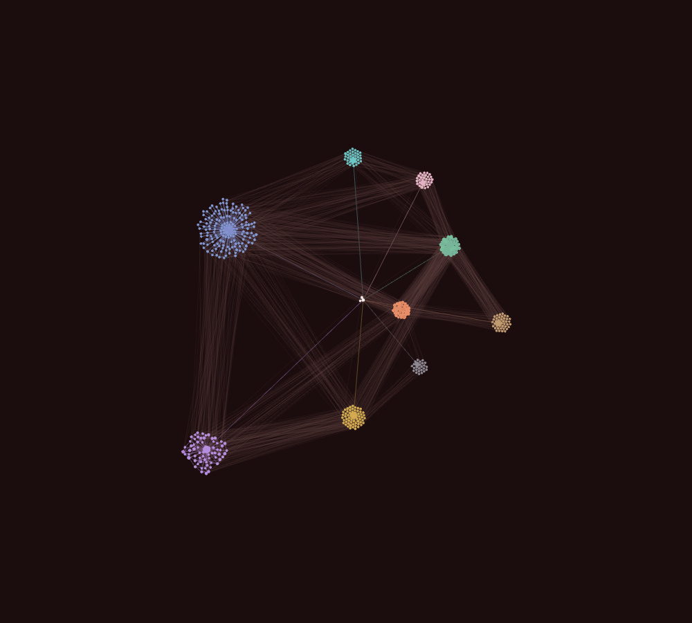
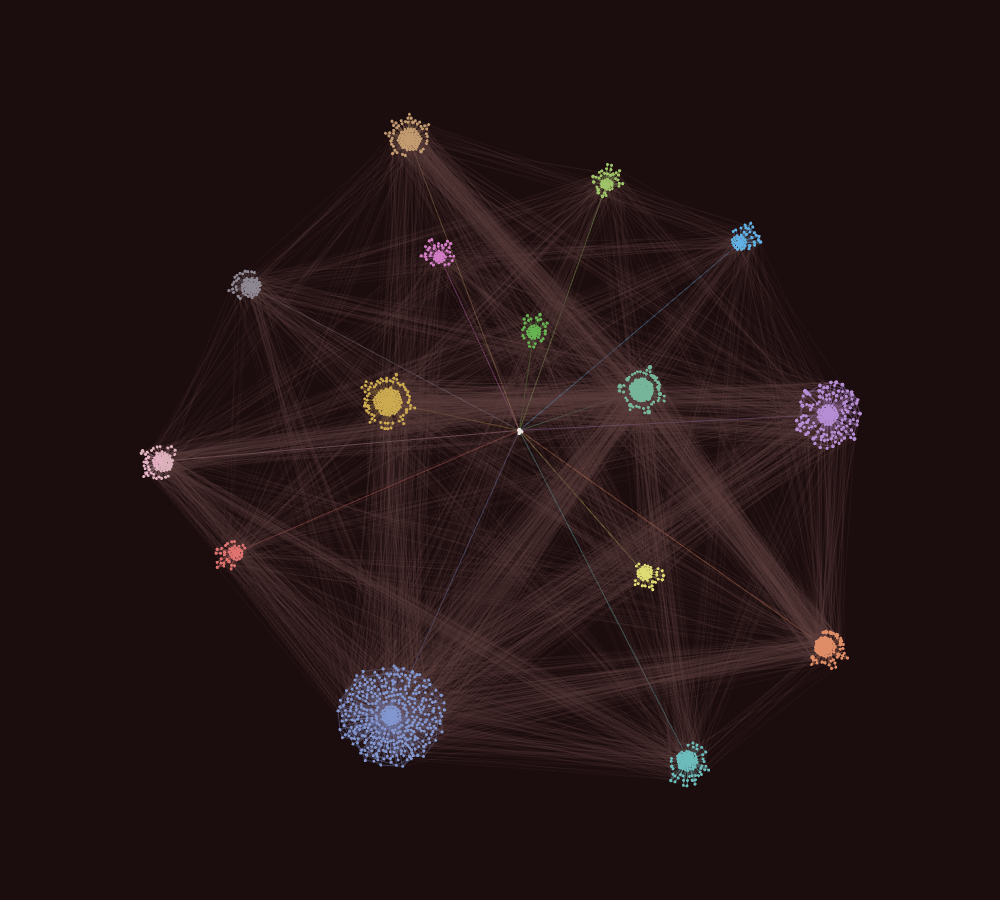
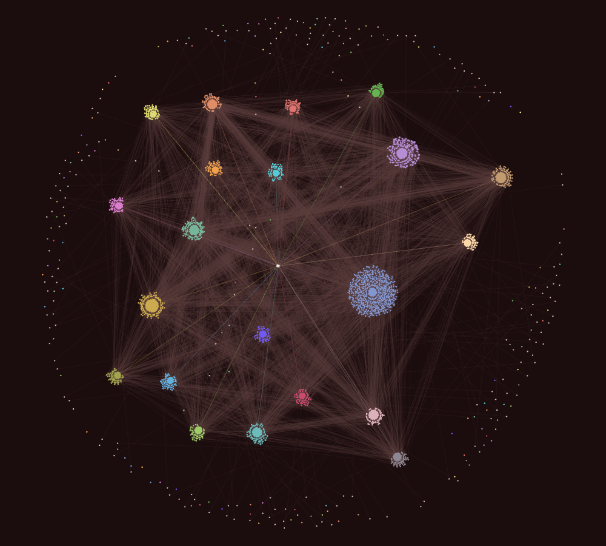

# Grape Clusters

## The Vineyard family

Vineyard is what I call the little Obsidian things I make and give away. There are two so far. They work fine on their own, but they look best together.

| | 💎 Obsidian | 🐙 GitHub |
|---|---|---|
| 🍇 **Grape Clusters**, the plugin on this page | [Plugin page](https://community.obsidian.md/plugins/grape-clusters) | [Repository](https://github.com/creativemindrito/grape-clusters-obsidian) |
| 🍷 **Bordeaux**, the dark red theme in the screenshots | [Theme page](https://community.obsidian.md/themes/bordeaux) | [Repository](https://github.com/creativemindrito/bordeaux-theme-obsidian) |

My graph view never really showed me anything. I'd open it to see how my notes hang together and get one big grey knot in the middle of the screen. That happens because my notes link across folders all the time: a journal entry mentions a project, a project mentions a person. Obsidian pulls all of that into one pile.

I went looking for a setting to group the graph by folder. There isn't one. There are plugins that come close, but they either add extra folder nodes to your graph or swap it for a view of their own. I wanted something simpler: keep Obsidian's own graph, with my links and my colors, and let every folder pull its notes together. I couldn't find one that does just that, so I made my own.

Grape Clusters pulls the notes in each folder together into their own bunch. Your links don't go anywhere. They're all still there, but the ones between folders are drawn lighter so you can actually see the groups. I tested it on a vault with about 500 notes and 1,800 links. That's the screenshot above. Then I kept going to 3,000.

## How it looks

I wanted to see if it holds up in a big vault, so I grew the same test vault in three steps. Every folder has its own color. These are real screenshots from Obsidian.

**500 notes in 9 folders**

**1,500 notes in 15 folders**

**3,000 notes: 2,700 in 21 folders and 300 loose ones**

I added the 300 loose notes on purpose, to see how notes outside the clusters behave. Half of them sit in a folder but aren't linked to anything. The other half live outside every folder and link in. Grape Clusters doesn't pull them in, so they float around the edge.

At 3,000 notes the graph stutters a bit when you zoom all the way out. Zoomed in, it's smooth.

## How it works

The graph view is really two things. One part draws the dots and lines. The other part runs the physics that decides where every dot ends up.

Grape Clusters only changes what the physics gets to see. It keeps the links between notes in the same folder. It also keeps a few links from the notes in the root of your vault to the main note of each folder, which I call the backbone. That's what stops the clusters from drifting apart. Every other link is still drawn. The physics just doesn't pull on it.

The main note of a folder is any note that's linked with at least half of that folder, in either direction. You probably have one already: an index, a status note, a "start here" note. Grape Clusters finds it by itself.

Tags, attachments and links to notes you haven't written yet have no folder of their own, so they join the folder that uses them. If several folders use the same one, it stays loose and is only drawn. That way one `#todo` can't pull every folder back into a knot.

A cluster is a top-level folder by default. If you keep your projects in subfolders, set *Folder depth* to 2 and every subfolder becomes its own bunch.

## Tips

- A cluster is made of links, not of folders. Grape Clusters only uses the links between notes in the same folder, so a folder whose notes don't link to each other stays a loose handful of dots. One index note per folder, linking to every note in it, is the fastest way to fix that.
- Give each folder its own color. In the graph settings, open *Groups* and add something like `path:"Journal/"` with a color. The layout does the grouping; the color is what makes you see it.
- Small folders stay small. A folder with one or two notes can't become a bunch, and that's fine.
- These are the graph settings I use myself. Forces: center force 0, repel force 15.36, link force 0.66, link distance 102. Display: node size 1.18, link thickness 0.44, text fade threshold 0.8, arrows off. Start there and nudge until it feels right.

## Settings

| Setting | What it does | Default |
|---|---|---|
| Cluster by folder | Turns the whole thing on or off | On |
| Backbone | Keeps the clusters hooked to the notes above them, like the ones in your root folder | On |
| Folder depth | How deep a cluster forms: 1 is a top-level folder, 2 is every subfolder | 1 |
| Links between clusters | How visible the links between folders are | 15% |
| Links inside a cluster | How visible the links inside a folder are | 40% |
| Color links by folder | Lines inside a cluster get the color of that folder | On |
| Show a summary | Pops up a small notice with the numbers when the graph rebuilds | Off |

There's also a command called *Toggle folder clusters* if you want to flip back to the normal graph quickly.

## Install

There are three ways. Pick the one you like.

- **In Obsidian:** open *Settings → Community plugins*, click *Browse* and search for Grape Clusters. Click *Install*, then *Enable*. Never used community plugins before? Obsidian asks you to turn them on first.
- **On the Obsidian website:** open the [Grape Clusters page](https://community.obsidian.md/plugins/grape-clusters) and click *Add to Obsidian*. Obsidian opens on the plugin, and you click *Install* and *Enable*.
- **By hand:** download `main.js` and `manifest.json` from the [latest release](https://github.com/creativemindrito/grape-clusters-obsidian/releases/latest). Put both files in a folder called `grape-clusters` in `.obsidian/plugins/` inside your vault, then switch it on under *Settings → Community plugins*.

Then open the graph view.

## Privacy

Grape Clusters doesn't connect to the internet and it never touches your notes. The only file it writes is its own settings file. The whole plugin is one file (`main.js`) without any dependencies, so you can read all of it if you like.

Every release is put together by GitHub itself from the tagged commit, and the files carry a GitHub attestation. If you want to check a download, run `gh attestation verify main.js --owner creativemindrito`.

## Heads-up

The plugin hooks into parts of the graph view that aren't an official Obsidian API. I tested it on Obsidian 1.13 on a computer. I haven't tried it on a phone yet. If a future update changes those parts, Grape Clusters won't break your graph. It just stops doing anything and tells you once. Turning it off always gives you the normal graph back.

It only changes the big graph view. The local graph in the sidebar is left alone.

## If nothing changes

- Check that you're looking at the big graph view and not the local graph.
- Clusters come from folders: top-level ones, unless you raise *Folder depth*. Notes in the root of your vault don't get a cluster of their own.
- A folder whose notes don't link to each other can't form a bunch. Give it an index note.
- Still the same? Close the graph tab and open it again.

## Uninstall

Switch it off under *Settings → Community plugins* and the normal graph is back right away. Hit *Uninstall* there if you want it gone for good.

## Made by

[creativemindrito](https://github.com/creativemindrito). Free to use under the [MIT license](LICENSE). Found a bug or have an idea? Open an issue. I'd like to hear it.
